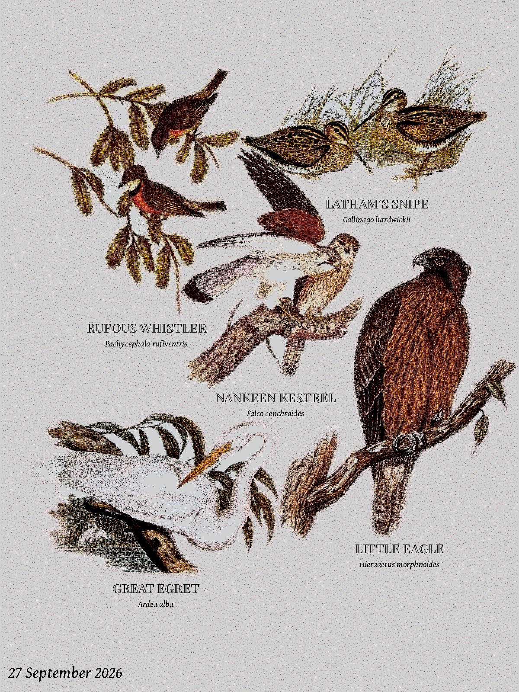
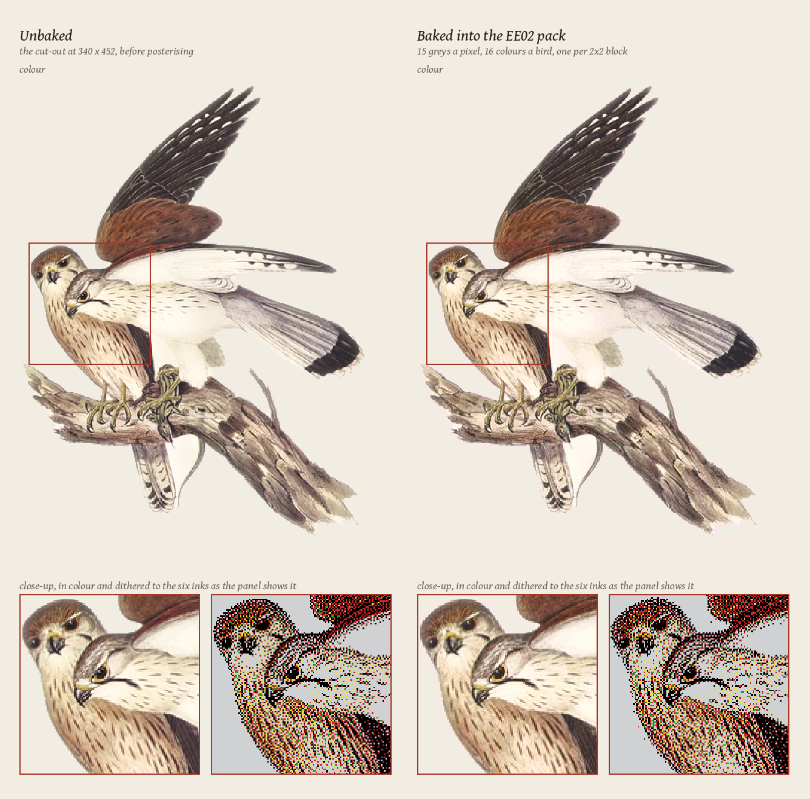
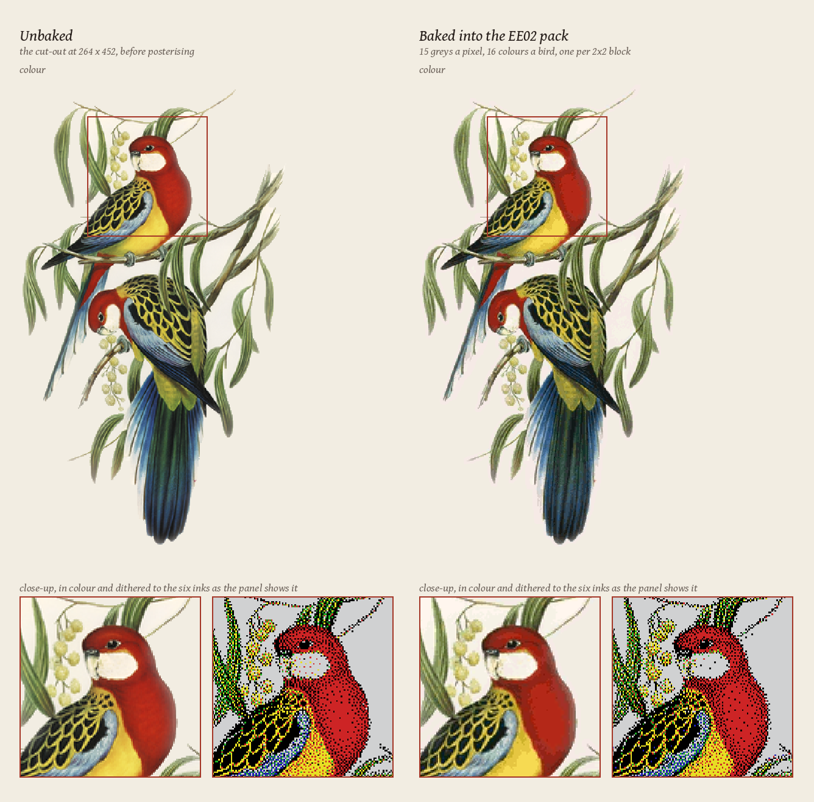

# Bird Poster (ESP32)

A battery e-ink bird poster: it asks the network which birds have been seen
nearby, draws them as public-domain illustrations packed onto one page, and goes
back to sleep.

Inspired by the awesome Bird Frame project [Fugleramme](https://github.com/arnegiacomo/fugleramme).

<p align="center">
  
</p>

*A page as the frame draws it: 1200 x 1600, dithered to the panel's six inks.*

## How it works

WiFi → species list → plate pack in flash (or on the SD card) → silhouette
packer → 6-colour dither → the glass.

There is no microphone and no classifier on the device. It asks something else
what has been heard or seen, and spends its power budget on the picture. The
detection source is a setting on the frame's own web page:

- **[BirdNET-Go](https://github.com/tphakala/birdnet-go)** on your LAN, if you
  run one — it listens on a mic and identifies birds by sound, and the frame
  reads its recent detections over HTTP.
- **[iNaturalist](https://www.inaturalist.org/)**, for a latitude, longitude and
  radius — what people have actually recorded near you. Its rarest-birds page
  ranks by how few times a species has been recorded worldwide.
- **[eBird](https://ebird.org/)**, recent observations or the *notable* list
  within a radius. Needs a free API key, entered on the settings page.
- **[Atlas of Living Australia](https://www.ala.org.au/)**, occurrences within
  a radius.
- **A JSON list** at a URL of your own — for anything else that can write a
  list of scientific names.

All are public; only eBird wants a key. A **Test source** button on the
settings page runs the request and shows exactly what came back, or why not.

## Hardware

Two boards carry the same 13.3" Spectra 6 panel:

- a [Seeed XIAO ESP32-S3 Plus](https://wiki.seeedstudio.com/xiao_esp32s3_getting_started/)
  in Seeed's **EE02** e-paper driver board — 16 MB flash, one region's plates;
- Seeed's [**reTerminal E1004**](https://wiki.seeedstudio.com/getting_started_with_reterminal_e1004/)
  — the same glass in a case with a battery, 32 MB flash and a microSD slot.

The firmware needs the 8 MB of PSRAM, since the packer's occupancy
grid and the sprite masks do not fit in internal SRAM. Pin maps,
the battery budget and the build order are in
[`firmware/docs/IMPLEMENTATION.md`](firmware/docs/IMPLEMENTATION.md).

> **What has actually been tested on hardware:** the XIAO in the EE02 with
> the Australian plates. The reTerminal E1004 build - its pin map, the shared
> SPI bus with the SD slot, the card packs - and the European and North
> American packs compile and render on the desktop harness but have not yet
> been run on a board. Treat them as beta and report what you find.

## Art

The birds are cut-outs from historic, public-domain natural-history plates,
curated for this project. Each species is matched to its illustration by
scientific name, background-removed, and packed onto a paper-toned page by its
silhouette, every bird at one size. An empty window shows a status page.

Artwork is **not** limited to what a classifier can name. Images are keyed on
the scientific name, so a plate for a bird BirdNET has no label for is still
reachable from iNaturalist or eBird — which matters, because 335 of the 871
bird species recorded in Australia have no BirdNET v2.4 label at all.

| style | plates | species |
| --- | ---: | ---: |
| `au` — Gould's *The Birds of Australia*, plus one plate apiece from other public-domain works for the birds he lacked | 771 | 724 |
| `eu` — Gould's *Birds of Europe*, von Wright's *Svenska Fåglar*; cut-outs from Fugleramme, CC BY-SA 4.0 | 811 | 415 |
| `us` — Audubon's *The Birds of America*, plus one plate apiece from other public-domain works for the birds he lacked | 552 | 522 |

### The plate pack

Each region's artwork is baked into one **plate pack**, which is
what the flash or SD card holds and what the flasher ships. Per species it
holds the silhouette, a posterised sprite and every spelling a source might
use for the name. Sprites are posterised to 15 grey levels a pixel and 16
colours a bird (one per 2×2 block), then compressed without further loss by
predicting each pixel from the ones already next to it. A bird comes to about
19 KB in the EE02's Australian pack, roughly a third smaller than the
general-purpose compression used in zip files and PNGs would make it. The
device dithers each bird to the panel's six inks at the size it is drawn.

<p align="center">
  
</p>

*Before and after baking: the Nankeen Kestrel at its 452 px EE02 size, with close-ups in
colour and dithered as the panel shows it.*

<p align="center">
  
</p>

*The same for a colourful plate, the Eastern Rosella. Where the bake falls
short is the large red areas: the breast's shading from scarlet to crimson is
a change of hue more than of lightness, and with only 16 colours for the whole
bird it is posterised into a few flatter bands of red. After dithering the difference is hidden, as seen in the close-ups.*

### How the packs are compressed

Each sprite is two planes: a grey level for every pixel (one of 15, or
"transparent"), and a colour for every 2×2 block (one of the bird's 16).
Both are compressed without loss by a range coder driven by a context model.
Before each value is stored, the coder estimates how likely every possible
value is from what has already been decoded around it, then spends few bits on
a likely value and more on a surprising one.

- **Grey levels** are predicted from the pixel to the left, the pixel above,
  and the slope of the row above, starting from odds learned across a few
  hundred plates and built into the firmware.
- **Colours** are predicted from the block to the left, the block above and
  the block's own brightness. Blocks wholly outside the bird are not stored.

When the 16 colours are fitted, each pixel counts in proportion to its
brightness. Colour barely shows on a dark pixel, so this stops the black in a
block pulling its colour towards grey, and thin coloured detail between dark
markings - a rosella's yellow feather edges - keeps its colour.

The format is covered in
[`firmware/README.md`](firmware/README.md#how-a-page-is-drawn).

The packs are committed in [`firmware/packs/`](firmware/packs/), each baked
to fill its room (`--fit` shrinks the sprite size from 1200 px until the pack
fits the budget, confirmed against the real bake):

| pack | birds at | for |
| --- | ---: | --- |
| `ee02/<region>.bin` | 452–596 px | the XIAO in the EE02, ~13.6 MB, one region |
| `e1004/<region>.bin` | 380–508 px | the E1004's 31 MB shared by all three regions |
| `e1004-one/<region>.bin` | 692–896 px | the E1004's 31 MB given to one region |
| `card/<region>.bin` | 1200 px | the E1004's microSD card, and the web plates, at full size |

The artwork PNGs themselves (2 GB) are not in the repository - only each
style's `manifest.json`, `ATTRIBUTION.md` and species lists, and the packs
baked from them. Rebaking needs the cut-outs on the workstation.

### Full-size plates from the web

A pack in flash holds each bird at the size its partition allows (452-596 px for EE02). When a bird
is drawn much larger than that - a page of one or two birds - the frame fetches
the same plate at full size (1200 px) from the web and falls back to local if
the site does not answer. The flasher's build publishes them beside the page,
one file a species, at `https://c4kew4lk.github.io/bird_poster/plates/<region>/`,
which is the frame's default; any other copy (`firmware/tools/export_web_plates.py`)
can be entered on its settings page.

## Flash it

No toolchain needed: **<https://c4kew4lk.github.io/bird_poster/>** flashes the
latest build from Chrome or Edge over USB. Pick the frame, then the artwork:

- **XIAO in the EE02** — Australia, Europe or North America, one region's plates.
- **reTerminal E1004** — every region at once (the region is then a setting on
  the device), or one region alone at a larger size. Its **SD card** section
  offers each region's plates at full size: copy the file to a FAT32 card as
  `plates-<region>.bin` and the frame draws from it in preference to flash.

Three installs: everything (a first install), the app alone (an update that
keeps the artwork and settings on the board), the plates alone (new artwork).
The page is rebuilt by [`.github/workflows/flasher.yml`](.github/workflows/flasher.yml)
on every push to `main`, from the same script that serves it locally, and
carries the full-size web plates with it; a tag push attaches the same images
to the [GitHub release](https://github.com/C4KEW4LK/bird_poster/releases) for
flashing with `esptool`.

On the frame's own settings page, besides the source: the arrangement
(classic, grid, scattered or one hero bird), the birds' order shuffled or the
source's ranking, how the names are set, colour, detail and edge strength for
the dither, a cream paper tone, today's date on the page, the refresh interval
(as short as a minute), and a refresh counter for measuring battery life. Every
page is a new arrangement of the birds, so the same birds come out in new
places each time.

## Build

```bash
pio run -e native            # desktop packer harness — renders a page to a PNM
pio run -e xiao              # build for the XIAO ESP32-S3 Plus in the EE02
pio run -e e1004             # build for the reTerminal E1004
pio run -e xiao -t upload    # flash
python3 firmware/tools/webflash.py           # the browser flasher, served locally on :8000
cd firmware && pio test -e native            # host tests: packer, sources, renderer
```

`pio` comes from PlatformIO (`pip install platformio`). The Python tooling
runs under `uv sync` (`uv run ruff check`, `uv run mypy` are what CI runs).

This repository holds what you need to build and flash the frame: the
firmware, the baked plate packs, the fonts and the flasher. The source artwork
and the tools that bake the packs are not included; only the finished packs
are committed.

## Repository layout

```
firmware/       the product: C++ for the ESP32-S3, plus a desktop harness for
                the same packer and renderer so layout work is a one-second loop
  lib/          packer, plates reader, renderer, panel driver, sources — Arduino-free but panel
  src/device/   the app: WiFi, settings page, sleep loop
  src/native/   the desktop harness
  test/         host tests over lib/ (pio test -e native)
  tools/        webflash.py (the flasher page), subset_font.py (the fonts for
                the frame), export_web_plates.py (the full-size web plates),
                planecoder.py (the packs' range coder and its learned prior)
  packs/        the baked packs the flasher and the release ship
  webflash/     the flasher page
  docs/         IMPLEMENTATION.md — pins, packer constants, battery, sources
assets/
  artwork/      au, eu, us — each style's ATTRIBUTION.md and manifest.json: the
                credits for every plate in the packs
  fonts/        the label faces (OFL): Gentium Book Plus Italic, and Gould
                Condensed, an engraved cut of Playfair Display made for this project
images/         pictures for this README: a page as the frame draws it, and
                birds before and after baking
```

## License

- Code: MIT — see [`LICENSE`](LICENSE).
- Bird images (the plate packs and the web plates): each style folder under
  `assets/artwork/` carries its own terms and sources, and its manifest links
  the plate every bird was cut from. `au` and `us` are
  CC BY-SA 4.0 (rawpixel's enhanced scans, cut for this project); `eu` is
  CC BY-SA 4.0 with the cut-outs credited to Fugleramme — see each folder's
  `ATTRIBUTION.md`.
- Label fonts (`assets/fonts/`): SIL OFL 1.1 — see
  [`assets/fonts/ATTRIBUTION.md`](assets/fonts/ATTRIBUTION.md).
- BirdNET: the plates are named to match BirdNET's labels (model by the Cornell
  Lab of Ornithology and Chemnitz University of Technology, taxonomy data
  powered by eBird.org). If you point the frame at a BirdNET-Go instance, that is
  CC BY-NC-SA 4.0 and non-commercial only.
