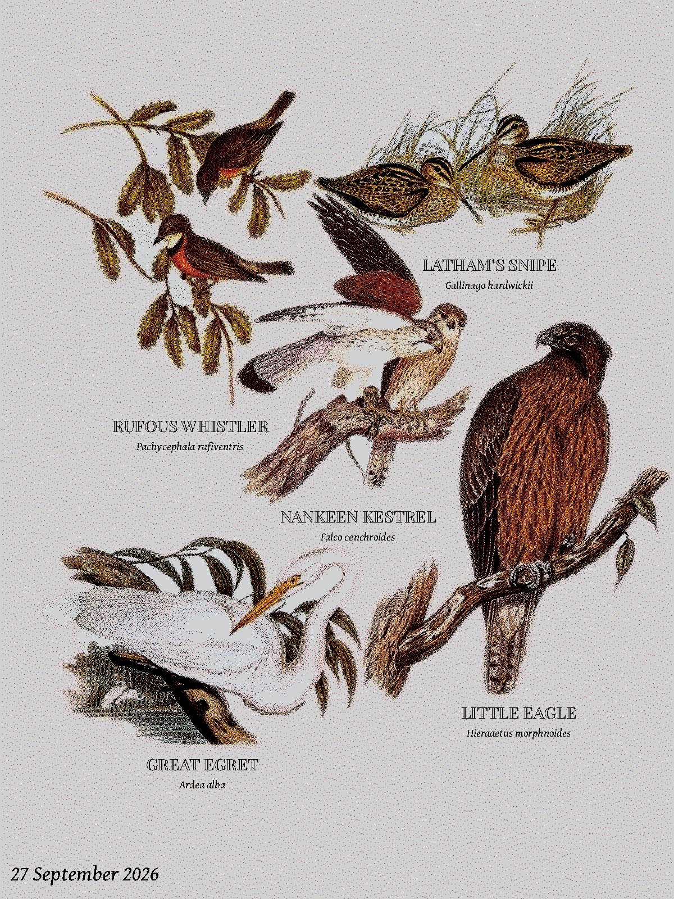

# bird frame (ESP32-S3)

A battery e-ink bird frame: it asks the network which birds have been seen
nearby, draws them as public-domain illustrations packed onto one page, and goes
back to sleep.

<p align="center">
  
</p>

*A page as the frame draws it: 1200 x 1600, dithered to the panel's six inks.*

## How it works

WiFi → species list → plate pack in flash (or on the SD card) → silhouette
packer → 6-colour dither → the glass.

There is no microphone and no classifier on the device. It asks something else
what has been heard or seen, and spends its power budget on the picture. The
detection source is a setting on the frame's own web page:

- **[BirdNET-Go](https://github.com/tphakala/birdnet-go)** on your LAN, if you
  run one — it listens on a mic and identifies birds by sound, and the frame
  reads its recent detections over HTTP.
- **[iNaturalist](https://www.inaturalist.org/)**, for a latitude, longitude and
  radius — what people have actually recorded near you. Its rarest-birds page
  ranks by how few times a species has been recorded worldwide.
- **[eBird](https://ebird.org/)**, recent observations or the *notable* list
  within a radius. Needs a free API key, entered on the settings page.
- **[Atlas of Living Australia](https://www.ala.org.au/)**, occurrences within
  a radius.
- **A JSON list** at a URL of your own — for anything else that can write a
  list of scientific names.

All are public; only eBird wants a key. A **Test source** button on the
settings page runs the request and shows exactly what came back, or why not.

## Hardware

Two boards carry the same 13.3" Spectra 6 panel:

- a [Seeed XIAO ESP32-S3 Plus](https://wiki.seeedstudio.com/xiao_esp32s3_getting_started/)
  in Seeed's **EE02** e-paper driver board — 16 MB flash, one region's plates;
- Seeed's [**reTerminal E1004**](https://wiki.seeedstudio.com/getting_started_with_reterminal_e1004/)
  — the same glass in a case with a battery, 32 MB flash and a microSD slot.

The 8 MB PSRAM both have is the reason for the ESP32-S3: the packer's
occupancy grid and the sprite masks do not fit in internal SRAM. Pin maps,
the battery budget and the build order are in
[`firmware/docs/IMPLEMENTATION.md`](firmware/docs/IMPLEMENTATION.md).

> **What has actually been tested on hardware:** the XIAO in the EE02 with
> the Australian plates. The reTerminal E1004 build - its pin map, the shared
> SPI bus with the SD slot, the card packs - and the European and North
> American packs compile and render on the desktop harness but have not yet
> been run on a board. Treat them as beta and report what you find.

## Art

The birds are cut-outs from historic, public-domain natural-history plates,
curated for this project. Each species is matched to its illustration by
scientific name, background-removed, and packed onto a paper-toned page by its
silhouette, every bird at one size. An empty window shows a status page.

Half the point of this project is showing off some amazing public-domain
natural-history illustration: every bird is cut from a real plate.

Artwork is **not** limited to what a classifier can name. Images are keyed on
the scientific name, so a plate for a bird BirdNET has no label for is still
reachable from iNaturalist or eBird — which matters, because 335 of the 871
bird species recorded in Australia have no BirdNET v2.4 label at all.

| style | plates | species |
| --- | ---: | ---: |
| `au` — Gould's *The Birds of Australia*, plus one plate apiece from other public-domain works for the birds he lacked | 771 | 724 |
| `eu` — Gould's *Birds of Europe*, von Wright's *Svenska Fåglar*; cut-outs from Fugleramme, CC BY-SA 4.0 | 811 | 415 |
| `us` — Audubon's *The Birds of America*, plus one plate apiece from other public-domain works for the birds he lacked | 552 | 522 |

### The plate pack

The frame never reads a PNG. Each region's artwork is baked into one **plate
pack** (format `FGPL` v6, baked on the workstation that holds the artwork), which is what the
flash or the SD card holds and what the flasher and the release ship. Per
species it carries the silhouette the packer places by, the pixels, the box
its name needs, and every spelling a source might ask with (BirdNET and
iNaturalist disagree on binomials, so each spelling is its own index row
pointing at the same pixels).

The pixels are compressed the way the six-ink panel can bear, not the way a
screen would want:

- **Luma and chroma apart.** Brightness and colour are posterised separately,
  because the eye resolves **shading about three times more finely than hue**
  (Mullen 1985 — the same fact behind JPEG's and video's chroma subsampling).
  So the brightness plane keeps every pixel and the colour plane one sample
  per 4×4 block.
- **15 grey levels a pixel** — chosen per bird by k-means over its painted
  pixels, so a dark bird spends its levels in the dark. The sixteenth code is
  "outside the silhouette", which makes the luma plane the packer's shape and
  the renderer's pixels in one.
- **16 colours a bird, one per 4×4 block** — also clustered per bird, weighted
  the way the frame's dither weights chroma. The device interpolates the
  colour between blocks when it draws, so the grid never shows.
- **zlib over the nibble planes.** Posterised planes are flat runs, which
  deflate well; a dithered image would be noise, which does not. That is why
  the pack is *not* pre-dithered: the dither runs on the device at the size
  the packer chose, because a dither rescaled is a dither wrong.

That comes to 240 colours a sprite for roughly 18-33 KB a bird at 400-500 px,
and it is why 724 species fit a 13.6 MB pack. The colour under transparent
pixels is zeroed in the cut-outs for the same reason: PNG cannot compress
paper grain either.

The packs are committed in [`firmware/packs/`](firmware/packs/), each baked
to fill its room (`--fit` shrinks the sprite size from 1200 px until the pack
fits the budget, confirmed against the real bake):

| pack | birds at | for |
| --- | ---: | --- |
| `ee02/<region>.bin` | 396–516 px | the XIAO in the EE02, ~13.6 MB, one region |
| `e1004/<region>.bin` | 336 px | the E1004's 31 MB shared by all three regions |
| `e1004-one/<region>.bin` | 608–768 px | the E1004's 31 MB given to one region |
| `card/<region>.bin` | 1200 px | the E1004's microSD card, and the web plates, at full size |

The artwork PNGs themselves (2 GB) are not in the repository - only each
style's `manifest.json`, `ATTRIBUTION.md` and species lists, and the packs
baked from them. Rebaking needs the cut-outs on the workstation.

### Full-size plates from the web

A pack in flash holds each bird at the size its partition allows. When a bird
is drawn much larger than that - a page of one or two birds - the frame fetches
the same plate at full size (1200 px) from the web and falls back to flash if
the site does not answer. The flasher's build publishes them beside the page,
one file a species, at `https://c4kew4lk.github.io/bird_poster/plates/<region>/`,
which is the frame's default; any other copy (`firmware/tools/export_web_plates.py`)
can be entered on its settings page.

## Flash it

No toolchain needed: **<https://c4kew4lk.github.io/bird_poster/>** flashes the
latest build from Chrome or Edge over USB. Pick the frame, then the artwork:

- **XIAO in the EE02** — Australia, Europe or North America, one region's plates.
- **reTerminal E1004** — every region at once (the region is then a setting on
  the device), or one region alone at a larger size. Its **SD card** section
  offers each region's plates at full size: copy the file to a FAT32 card as
  `plates-<region>.bin` and the frame draws from it in preference to flash.

Three installs: everything (a first install), the app alone (an update that
keeps the artwork and settings on the board), the plates alone (new artwork).
The page is rebuilt by [`.github/workflows/flasher.yml`](.github/workflows/flasher.yml)
on every push to `main`, from the same script that serves it locally, and
carries the full-size web plates with it; a tag push attaches the same images
to the [GitHub release](https://github.com/C4KEW4LK/bird_poster/releases) for
flashing with `esptool`.

On the frame's own settings page, besides the source: the arrangement
(classic, grid, scattered or one hero bird), how the names are set, colour,
detail and edge strength for the dither, a cream paper tone, today's date on
the page, and a refresh counter for measuring battery life.

## Build

```bash
pio run -e native            # desktop packer harness — renders a page to a PNM
pio run -e xiao              # build for the XIAO ESP32-S3 Plus in the EE02
pio run -e e1004             # build for the reTerminal E1004
pio run -e xiao -t upload    # flash
python3 firmware/tools/webflash.py           # the browser flasher, served locally on :8000
cd firmware && pio test -e native            # host tests: packer, sources, renderer
```

`pio` comes from PlatformIO (`pip install platformio`). The Python tooling
runs under `uv sync` (`uv run ruff check`, `uv run mypy` are what CI runs).

The repository holds what building and deploying needs: the firmware, the
baked packs, the fonts, and the flasher. The artwork and the pipeline that
curates it and bakes the packs - the cut-out PNGs, the scraping and naming
scripts, the BirdNET label sets and region lists, the bake tools - live on the
workstation that makes the packs and are not committed; after a rebake, the
new packs are.

## Repository layout

```
firmware/       the product: C++ for the ESP32-S3, plus a desktop harness for
                the same packer and renderer so layout work is a one-second loop
  lib/          packer, plates reader, renderer, panel driver, sources — Arduino-free but panel
  src/device/   the app: WiFi, settings page, sleep loop
  src/native/   the desktop harness
  test/         host tests over lib/ (pio test -e native)
  tools/        webflash.py (the flasher page), subset_font.py (the fonts for
                the frame), export_web_plates.py (the full-size web plates)
  packs/        the baked packs the flasher and the release ship
  webflash/     the flasher page
  docs/         IMPLEMENTATION.md — pins, packer constants, battery, sources
assets/
  artwork/      au, eu, us — each style's ATTRIBUTION.md and manifest.json: the
                credits for every plate in the packs
  fonts/        the label faces (OFL): Gentium Book Plus Italic, and Gould
                Condensed, an engraved cut of Playfair Display made for this project
images/         pictures for this README: a page as the frame draws it
```

## License

- Code: MIT — see [`LICENSE`](LICENSE).
- Bird images (the plate packs and the web plates): each style folder under
  `assets/artwork/` carries its own terms and sources, and its manifest links
  the plate every bird was cut from. `au` and `us` are
  CC BY-SA 4.0 (rawpixel's enhanced scans, cut for this project); `eu` is
  CC BY-SA 4.0 with the cut-outs credited to Fugleramme — see each folder's
  `ATTRIBUTION.md`.
- Label fonts (`assets/fonts/`): SIL OFL 1.1 — see
  [`assets/fonts/ATTRIBUTION.md`](assets/fonts/ATTRIBUTION.md).
- BirdNET: the plates are named to match BirdNET's labels (model by the Cornell
  Lab of Ornithology and Chemnitz University of Technology, taxonomy data
  powered by eBird.org). If you point the frame at a BirdNET-Go instance, that is
  CC BY-NC-SA 4.0 and non-commercial only.
